# <p align="center">Easy Platform for Identification of Complex Spikes (EPICS)<p>


## <p align="center">User guide and manual</p>
 


<a name=top></a>
# Contents
 
## 1. [Introduction: EPICS](#introduction)

## 2. [Getting started](#getting-started)

### 2.1. [Installation packages](#installation-packages)

#### 2.2. [Initialization](#initialization)

## 3. [How to use EPICS](#how-to-use-epics)

### 3.1. [STEP 1: Labeling your data](#step1)

#### 3.1.1. [Data format](#data-format1)

#### 3.1.2. [Set parameters](#set-parameters1)

#### 3.1.3. [Upload files](#upload-files1)

#### 3.1.4. [Label CSs in PC recordings](#label-css-in-pc-recordings)

#### 3.1.5. [Save the CSs labels for each PC](#save-the-css-labels-for-each-pc)

#### 3.1.6. [Save the final training dataset](#save-the-final-training-dataset)

### 3.2. [STEP 2: Training the network](#step2)
#### 3.2.1. [Allow access to google drive](#allow-access-to-google-drive)

#### 3.2.2. [Install the toolboxes on your google drive](#install-the-toolboxes-on-your-google-drive)

#### 3.2.3. [Upload training data](#upload-training-data)

#### 3.2.4. [Advanced parameters setting](#advanced-parameters-setting)

#### 3.2.5. [Train the network](#train-the-network)

#### 3.2.6. [Downloading weights](#downloading-weights)

### 3.3. [STEP 3: Detecting complex spikes](#step3)

#### 3.3.1. [Data format](#data-format2) 

#### 3.3.2. [Set parameters](#set-parameters2)

#### 3.3.3. [Single file mode detection](#single-file-mode-detection)

##### 3.3.3.1. [Upload file](#upload-files2)

##### 3.3.3.2. [Upload weights](#upload-weights1)

##### 3.3.3.3. [Detect CSs](#detect-css1)

#### 3.3.4. [Serial process mode detection](#serial-process-mode-detection)

##### 3.3.4.1. [Select a folder](#select-a-folder)

##### 3.3.4.2. [Select the target folder for saving the output](#select-the-target-folder-for-saving-the-output)

##### 3.3.4.3. [Upload weights](#upload-weights2)

##### 3.3.4.4. [Set output and log file names](#set-output-and-log-file-names)

##### 3.3.4.5. [Detect CSs](#detect-css2)

### 3.4. [STEP 4: Post-processing and verification](#step4)

#### 3.4.1. [Data format](#data-format3)

#### 3.4.2. [Set parameters](#set-parameters3)

#### 3.4.3. [Upload files](#upload-files3)

#### 3.4.4. [Plot data](#plot-data)

#### 3.4.5. [Select CS clusters](#select-cs-clusters)

#### 3.4.6. [Save CS clusters](#save-cs-clusters)

## 4.  [Troubleshooting](#troubleshooting) 

## 1. <a name="introduction">Introduction: EPICS </a>

We introduce an Easy Platform for Identification of Complex Spikes (EPICS) - a GUI tool that integrates all steps in detecting Complex Spikes (CSs). In EPICS, you can prepare the training dataset by manually labeling CSs of individual Purkinje cells (PCs), train the deep learning algorithm for detecting CSs, detect CSs, and finally, verify the detected CSs in a post-processing step. 

The Convolutional Neural Networks (CNN)—based deep learning algorithm for detecting cerebellar CSs (link: https://github.com/jobellet/detect_CS) is described in detail in our previous article, 'Using deep neural networks to detect complex spikes of cerebellar Purkinje cell' by Markanday et al. 2020 (link: https://doi.org/10.1152/jn.00754.2019).

In this document, we describe all the necessary steps and features of EPICS in a step-by-step manner. 

[<p align="right">back to top</p>](#top)

##  2. <a name="getting-started">Getting Started</a>

### 2.1 <a name="installation-packages">Installation Packages</a>

EPICS can be installed locally on both Widows and Mac-based operating systems. To download the installation packages follow the links below:

* WINDOWS 
(https://zenodo.org/record/6794284/files/EPICS.exe)

* MAC 
(https://zenodo.org/record/6794118/files/EPICS.dmg)

After downloading and unzipping the folders on your local drive, you can install EPICS by executing the EPICS.exe file for Windows and EPICS.dmg for Mac-based operating systems.


***Additional information:*** 
The PC test dataset used in Markanday et al 2020 can be downloaded from:
https://figshare.com/articles/dataset/Extracellular_recording_of_cerebellar_Purkinje_cells_and_labels_of_complex_spikes_from_expert/11872227

[<p align="right">back to top</p>](#top)

### 2.2 <a name="initialization">Initialization</a>

All codes are written in Python. Please clone the Github repository for viewing and modifying the codes. To run EPICS, run the file ***gui.py***. This is what the launching page of EPICS should look like:

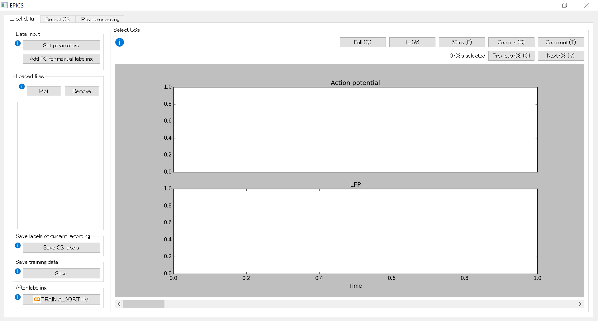

[<p align="right">back to top</p>](#top)

## 3. <a name="how-to-use-epics">How to use EPICS</a>

### 3.1  <a name="step1">STEP 1: Labeling your data</a>

#### 3.1.1 <a name="data-format1">Data format</a>
Before getting started with EPICS it is important to make sure that your input data is stored in the correct format. A file (i.e., PC recording) to be uploaded must contain the following variables: 
* High band-passed action potential: 1 x time
* Low band-passed LFP: 1 x time 

Although not necessary for labeling the data but if you have already labeled CSs elsewhere, you can also use them. In that case, 
* CS Labels: 1 x time (with values 1 during CS discharge, 0 otherwise)


All variables must be in Matlab file (.mat) format. 
Here is an example to save variables in MATLAB:
``` Matlab
    YourVariable = struct();
    YourVariable.HIGH = HIGH;
    YourVariable.RAW = RAW;
    YourVariable.Labels = Labels;

    save(FileName, '-struct', 'YourVariable');
```    
An example to save variables in Python:
``` Python
    import scipy.io as sp

    sp.savemat(FileName, 
        {HIGH: HIGH, LFP: LFP, Labels: Labels,}, 
        do_compression=True)

    # HIGH, LFP, Labels are numpy arrays
```    
[<p align="right">back to top</p>](#top)

#### 3.1.2 <a name="set-parameters1">Set Parameters</a>

The first thing to do when getting started with EPICS is to set parameters. Click the ***Set parameters*** button in the ***Data input*** section in the top left corner. Here, you can set the following parameters (see image below).
* **Sampling rate [Hz]:** This is the sampling rate of your PC recordings. It should be the same for action potentials (APs) and LFPs.
* **Action-potential (AP) variable name:** The name under which AP signal is stored in your input data.
* **LFP variable name:** The name under which the LFP signal is stored in your input data.
* **CS label variable name:**  This is the name under which the variable containing CS labels will be saved after you are done with manual labeling. 
In case, if you have already labeled the CS data elsewhere and want to view, modify or add more CSs to it in EPICS, then this would be the variable name under which CS labels are stored in your input data. After modification, the new CS labels will be stored with the same variable name      
* **Important Note:** The algorithm's performance relies on both LFP and AP signals. We have not tested and therefore do not recommend using only AP as the input. However, in case your LFP signal is missing, and you still want to give EPICS a try, you can set the LFP variable name the same as that for AP (for example, set "HIGH" as the variable name for both AP and LFP variables).

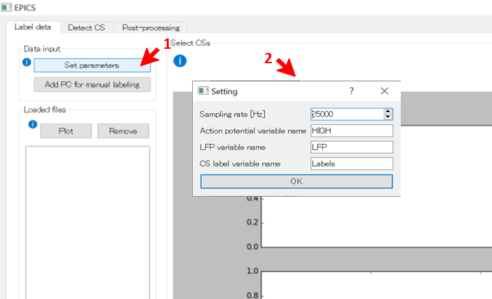

[<p align="right">back to top</p>](#top)

#### 3.1.3 <a name="upload-files1">Upload files</a>

After setting the parameters, click on the ***Add PC for manual labeling*** button below the ***Set parameters*** button and navigate to the folder with your PC recording files. 

Select a file and press ***open*** to load it. The selected file should be plotted instantly after loading. 

Alternatively, you can also load more files. In this case, all files will be added to the list in the ***loaded files*** section on the left, where you can select single files to plot or remove.
After uploading and plotting, the GUI should look like this:
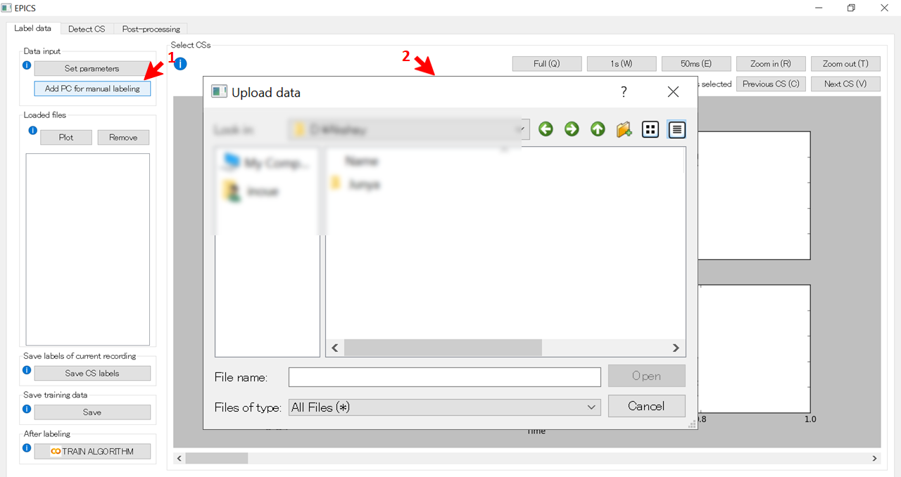

[<p align="right">back to top</p>](#top)

#### 3.1.4 <a name="label-css-in-pc-recordings">Label CSs in a PC recording</a>

**Selecting a CS**
To label CSs, you can select a CS by clicking at the onset and dragging till the offset of a CS. The selected span will be highlighted in red color. Select CS spans as accurately as possible in order to create a good training set. 
Tip: We recommend labeling at least 10 CSs uniformly throughout the PC recording (not just from the first few seconds, for example) so as to capture changes in CS wave morphology that may occur during a session. <br/>
**Deselecting a CS**
You can deselect a CS by simply clicking on the selected CSs (i.e., spans highlighted in red).

**Features for visualization**
1. **Adjusting the timescale**
You can also dynamically adjust the timescale of the plots in order to "zoom in" our "zoom-out" for better visualization and manual detection of onset and offsets of putative CSs. To change the timescale, use the following button functions (and keyboard shortcuts):
* **Full (Q):** Set the time scale to the full span of the recording session
* **1s (W):** Set the time scale to 1 s
* **50ms (E):** Set the time scale 50 ms
* **Zoom in (R\):** Zoom in
* **Zoom out (T):** Zoom out <br/>
2. **Moving along the time axis**
Use the **slider** below the plots to move along the time axis, or keyboard shortcut **(D)** for going backward and **(F)** for going forward.

3. **Viewing the selected CSs**
If you want to check CSs that you have already selected, use the following function buttons (and keyboard shortcut):
* **Previous CS (C):** Jump to the previous CS
* **Next CS (V):** Jump to the next CS
This is an example of a selected CS:
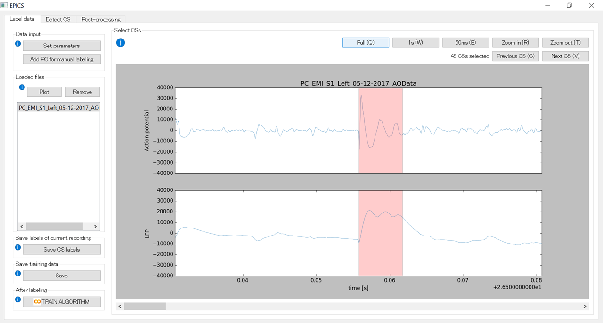

After labeling the first recording, select another file in your list and press "plot" to plot the new recording in the GUI, and proceed with labeling.

[<p align="right">back to top</p>](#top)

#### 3.1.5 <a name="save-the-css-labels-for-each-pc">Save the CSs labels for each PC</a>
This step is not necessary, but if you want to save your CS labels of each PC recording separately and reuse them for a different training set, use the **'Save CS labels'** button in the 'Save labels of current plot' section. This will save the following variables in .mat format, just the same as the ones that you upload.
* **High band-passed AP:** 1 x time
* **Low band-passed LFP:** 1 x time
* **CS labels (optional):** 1 x time (1 during CS discharge, 0 otherwise)

[<p align="right">back to top</p>](#top)

#### 3.1.6 <a name="save-the-final-training-dataset">Save the final training dataset</a>

After labeling all the uploaded files, press the **'Save'** button in the Save training data section. This will not save the full span of the recording, but automatically select only the selected CS spans and some time before and after them from each file to include non-CS spans. This is done to reduce the data size, hence speeding up the training process.

[<p align="right">back to top</p>](#top)

### 3.2 STEP 2: <a name="step2">Training the network</a>

After saving the training data, click the **'TRAIN ALGORITHM'** button in the After labeling section, this will take you to a Google Colab notebook to train the network. Google Colab is a free cloud computing service for Jupyter notebook offered by Google. Here you can train your network fast and easily, thanks to Google's powerful computational resources.
You can run each cell by clicking the triangle on the left or *Shift+Enter*. <br/>
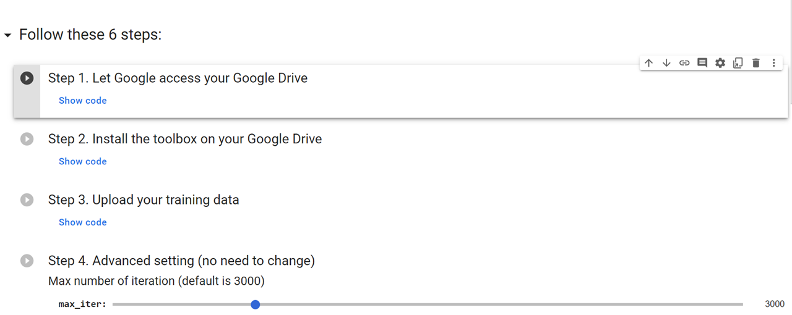

[<p align="right">back to top</p>](#top)

#### 3.2.1 <a name="allow-access-to-google-drive">Allow access to google drive</a>

First, in order to run this notebook, you need to give Google permission to access your Google Drive.

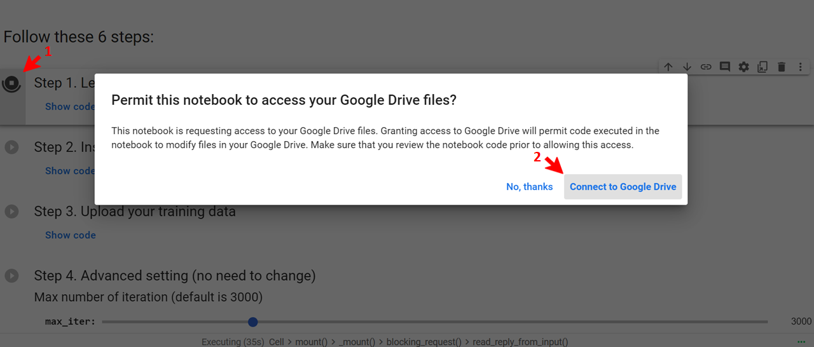

[<p align="right">back to top</p>](#top)

#### 3.2.2 <a name="install-the-toolboxes-on-your-google-drive">Install the toolboxes on your google drive</a>

This cell installs the necessary tools on your Google Drive. This process can take a few minutes.
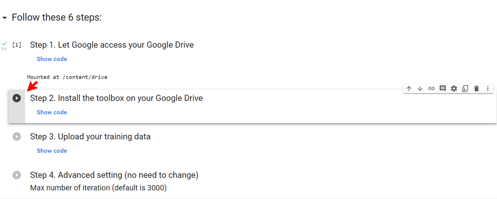

[<p align="right">back to top</p>](#top)

#### 3.2.3 <a name="upload-training-data">Upload training data</a>
By running this cell, you can upload the training data that you have saved in STEP 1.
If you receive an error *"MessageError: TypeError: google.colab.files is undefined"*, check your browser's setting and allow third-party cookies.


[<p align="right">back to top</p>](#top)

#### 3.2.4 <a name="advanced-parameters-setting">Advanced parameters setting</a>
You can adjust the parameters listed below only when the training does not yield good results in detecting CSs. Otherwise, use default values. But you still need to run this section for the training to proceed.
1. **Max number of iterations:** max_iter: (default is 3000)

2. **The number of bins (nb) that are taken into account by the network:**
The default value (562) was used for a sampling rate of 25 kHz. 
It is given by, nb=mp2+mp2⋅ks+(mp⋅ks)−mp+2ks−2
* *ks:* kernel size, default is 9, needs to be odd
* *mp:* max pooling, default is 7, needs to be odd <br/>
If the sampling rate is very different from 25kHz and the training does not work well, you might need to increase or decrease ks and mp for a higher and lower sampling frequency, respectively.

3. **The number of validation samples:** A criterion used to stop iteration earlier. If you have a small training set and the training shows an error, you should consider reducing this number (the default is 10). 


For more details please see Markanday et al 2020. <br/>

[<p align="right">back to top</p>](#top)

#### 3.2.5 <a name="train-the-network">Train the network</a>

By running this cell, you can train your network. It can take a while depending on the size of your data.

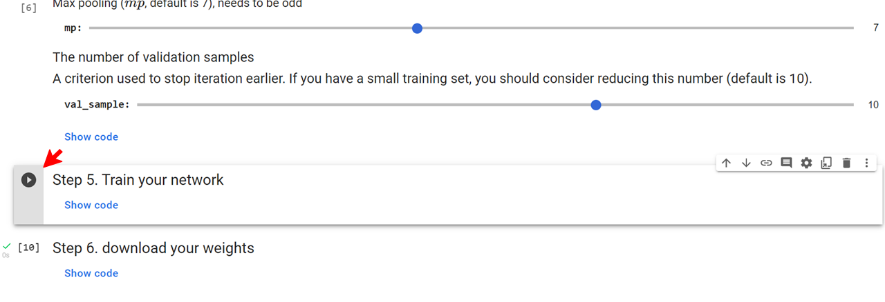

[<p align="right">back to top</p>](#top)

#### 3.2.6 <a name="downloading-weights">Downloading weights</a>

After training your network, you can run this cell to download the weights named “my_weights”. You can return to the GUI after completing this last step.


[<p align="right">back to top</p>](#top)

### 3.3 STEP 3: <a name="step3">Detecting complex spikes</a>

Open EPICS again and click on the **"Detect CS"** tab at the top. This is what the detection tab looks like when re-entering:


There are two ways of detecting CSs, *single file mode detection*, and *serial process mode detection*. We will discuss each of them later in section 3.3.3 and section 3.3.4, respectively. 

[<p align="right">back to top</p>](#top)

#### 3.3.1 <a name="data-format2">Data format</a>

The test dataset must contain the following variables in .mat format.
* **High band-passed AP:** 1 x time
* **Low band-passed LFP:** 1 x time

Additionally, you can also include simple spikes (SS) in this dataset. 
* **SS train (optional):** 1 x time <br/>

SSs are not used in the CS detection process but are useful in verifying the quality of CSs by plotting SS firing rate around CS onset, later during post-processing. The sampling rate of the SS train can be different from the other two variables (default is 1000 Hz). You can change the SS sampling rate later in **Setting for plot** button in the third tab when you plot the detected CSs. If the SS train is not available, leave the variable name empty.

[<p align="right">back to top</p>](#top)

#### 3.3.2 <a name="set-parameters2">Set parameters</a>
Set the parameters (sampling rates and variable names) as described in section 2.4. 

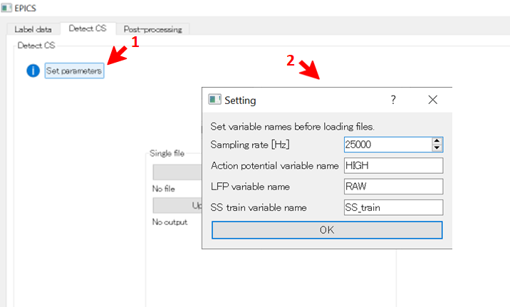

[<p align="right">back to top</p>](#top)

#### 3.3.3 <a name="single-file-mode-detection">Single file mode detection</a>
In this mode, the detection process runs on a single PC recording. This allows you to check the algorithm's performance in detecting CSs in a particular PC test dataset. If the performance is not up to your standards, you may consider adjusting the Advanced parameter settings discussed in section 3.2.4.

[<p align="right">back to top</p>](#top)

##### 3.3.3.1 <a name="upload-files2">Upload file</a>

In the Single file section, click the **'Upload a PC recording'** button to upload your file  containing the variables mentioned above.

##### 3.3.3.2 <a name="upload-weights">Upload weights</a>
To upload weights that you have downloaded from Google Colab, click the **'Upload your downloaded weights from Colab'** button.

##### 3.3.3.3 <a name="detect-css1">Detect CSs</a>

After uploading your PC recording (AP and LFP signals) and weights, click the **'Detect CS'** button to start detecting CSs. This process can take a while depending on the length of the recording and the computational power of your computer. <br/>
When CSs are detected, it will show the number of detected CSs and the output file can be saved. The output file contains the following variables:
**CS_onset:** Times of CS start (1 x # of CSs)
**CS_offset:** Times of CS end (1 x # of CSs)
**cluster_ID:** Cluster ID for each CS (1 x # of CSs)
**embedding:** Two-dimensional representation of CS feature space (number of CSs x 2)

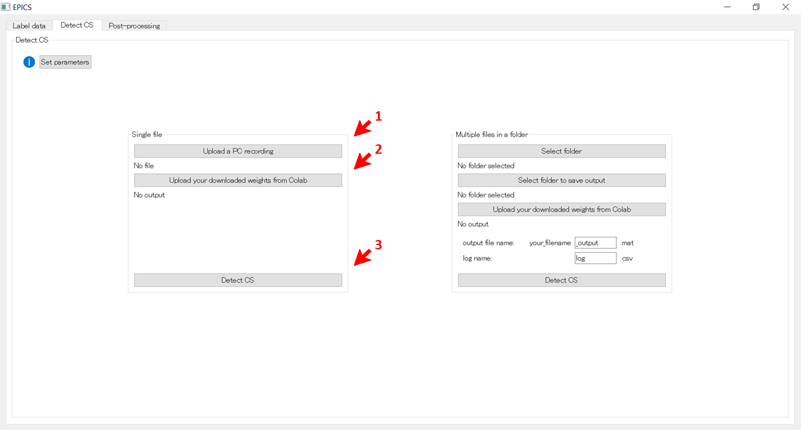

[<p align="right">back to top</p>](#top)

#### 3.3.4 <a name="serial-process-mode-detection">Serial process mode detection</a>
In this mode, the detection process runs on all files containing the PC test data within the folder, serially. You can use this option once you are sure that the training was successful <br/>

[<p align="right">back to top</p>](#top)

##### 3.3.4.1 <a name="select-a-folder">Select a folder</a>

You need to select a folder in which your recordings are saved. This folder should contain only those files which have the same format discussed in section 3.3.1. 

##### 3.3.4.2 <a name="select-the-target-folder-for-saving-the-output">Select the target folder for saving the output</a>

In Serial process mode, an output file is generated for each PC recording file. Therefore, you need to designate a folder for these output files. To do this, click the **'Select folder to save output'** button.

##### 3.3.4.3 <a name="upload-weights2">Upload weights</a>

Click the **'Upload your downloaded weights from Colab'** button to upload the weights that you have downloaded in section 3.2.6.

* **3.3.4.4 Set output and log file names**
After CSs have been detected in all the files, you'll find two types of files in the output folder: output files and a log file.
&emsp; **Output file name:** file name of the PC + _output.mat by default
&emsp; The output file contains the variables described in section 3.3.3.3.
&emsp; **Log file name:** log.csv by default.
&emsp; The log file is in .cvs format and consists of the file name, number of detected CSs, <br/> &emsp; number of clusters, and the sizes of each cluster.

##### 3.3.4.5 <a name="detect-css2">Detect CSs</a>

After uploading the PC recording and weights, click the **'Detect CS'** button to start detecting CSs. The program will check the format of all PC recordings and will tell how many files have been inspected. 
Check the files that did not match the format requirements by canceling them. Once you are satisfied, click the **'Proceed'** button. This process can take a while depending on the length and the number of PC recording files and the computational power of your computer.


[<p align="right">back to top</p>](#top)

### <a name="step4">3.4 STEP 4: Post-processing and verification</a>
The final step is to check the quality of CSs detected by the algorithm. The detected CSs are grouped into several clusters and you can select to save or discard individual clusters of CSs.
After successful detection of CSs, click on the third tab, 'Post-processing', in EPICS. This is what you should see:

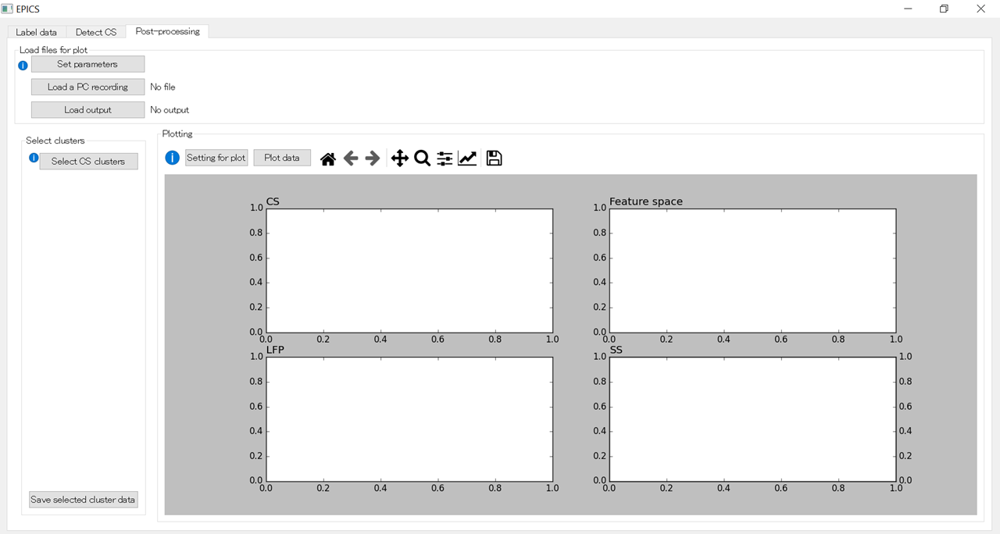

[<p align="right">back to top</p>](#top)

#### 3.4.1 <a name="data-format3">Data format</a>

For the post-processing, you need two files: 
1. A file of **PC recording** containing AP, LFP, and SS labels.
2. An **output file** containing CS_onset, CS_offset, cluster_ID, and embedding from section 3.3.3.3. <br/>

The last files that were used to detect CSs in section 3.3 are automatically loaded here. However, if you want to post-process other already saved files you can also upload them here. 

[<p align="right">back to top</p>](#top)

#### 3.4.2 <a name="set-parameters3">Set parameters</a>

Set parameters and variables as described previously in section 2.4.

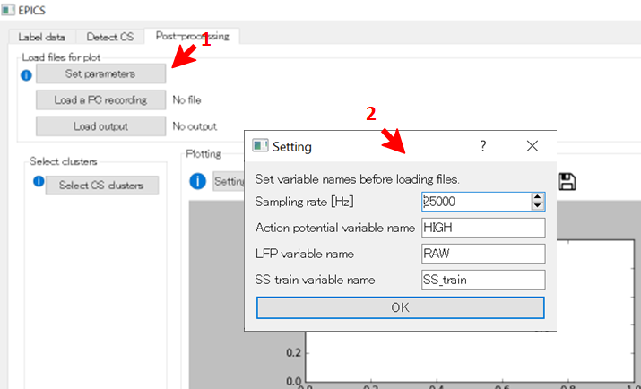

[<p align="right">back to top</p>](#top)

#### 3.4.3 <a name="upload-files3">Upload files</a>

Click the **'Load a PC recording'** and **'Load output'** buttons to load a file of PC recording and output file, respectively.

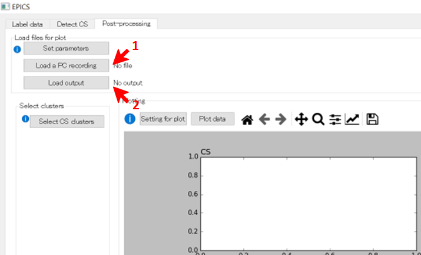

[<p align="right">back to top</p>](#top)

#### 3.4.4 <a name="plot-data">Plot data</a>

Once you have uploaded your files, you can plot the data by clicking the **'Plot data'** button in the Plotting section. You should see 4 plots.
* **CS (top left):** Individual (light-colored) and averaged (bold and dark-colored) high-passed AP CS waveforms aligned to CS onset. Each color refers to a particular cluster.
* **LFP (bottom left):** The associated Individual (light-colored) and averaged (bold and dark-colored) LFP waveforms aligned to CS onset.
* **Feature space (top right):** Dimensionally reduced feature space by UMAP. This was used to cluster CSs.
* **SS (bottom right):** SS raster and mean firing rates aligned to CS onset. If the SS train variable is not available, this will not be plotted.

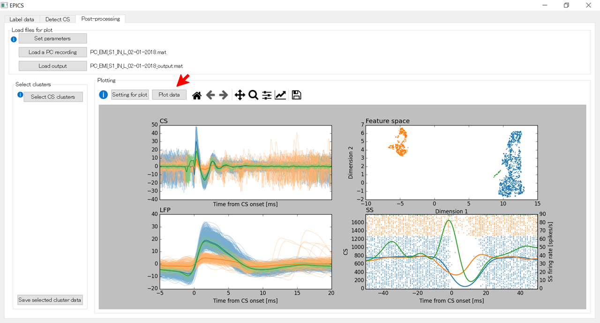


You can also change the following parameters for plotting by clicking the **'Setting for plot'** button.
* **SS sampling rate:** Sampling rate of the variable SS train.
* **Time range from CS & LFP:** Time before and after CS onset in ms.
* **Marker size for feature space:** Size of markers (dots) for the feature space plot.
* **SS raster sorted by:** You can sort the SS either by 
&emsp; **1. cluster:** grouped by clusters of CSs 
&emsp; **2. time:** occurrence of SSs
* **Gaussian kernel size:** Mean firing rates of SSs are computed after convolving them with a Gaussian kernel. You can change the size of the kernel.
* **Marker size for SS raster:** Size of markers (dots) for the SS raster plot.
* **The time range for SS raster:** Time before and after CS onset in ms for SS raster and mean firing rates.
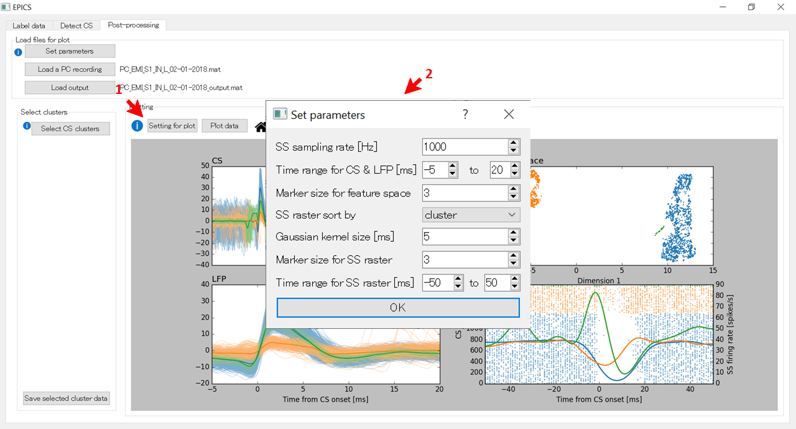

[<p align="right">back to top</p>](#top)

#### 3.4.5 <a name="select-cs-clusters">Select CS clusters</a>

After plotting, you can select which CS clusters to save, based on the shapes of CS/LFP, the distance between clusters in feature space, and the duration of the pause in SS firing after CS.

First, click the **'Select CS cluster'** button in the Select clusters section. Then you will see checkboxes, the size of clusters, and cluster ID labeled with different colors. By default, all clusters will be saved. If some of the clusters do not qualify as CSs, uncheck the checkbox and click the **'Update'** button. This button removes the unchecked cluster and updates the plots on the right.

If you feel that two different clusters look very similar, you can also merge them by assigning the same color (=cluster IDs) by clicking on the colored squares next to the checkboxes. 

[<p align="right">back to top</p>](#top)

#### 3.4.6 <a name="save-cs-clusters">Save CS clusters</a>

After updating the CS clusters by clicking the **'Update'** button, you can save the CS clusters that you have selected by clicking the **'Save selected cluster data'**. The saved format is the same as the output file.
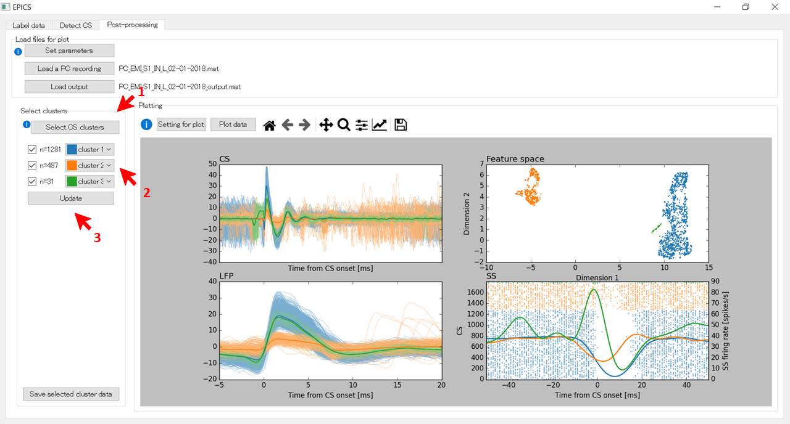

[<p align="right">back to top</p>](#top)

##  4. <a name="troubleshooting">Troubleshooting </a>

In case the EPICS crashes, there are several things that you can check and try.
* First of all, check again the formats and variable names of your files. Unexpected formats may cause errors.
* In order to see what kind of errors are returned, you can run from a command prompt (on Windows) or terminal (on Mac).
* Also, if the data is too large, you can try dividing the recordings into small parts to reduce the data size.

[<p align="right">back to top</p>](#top)
