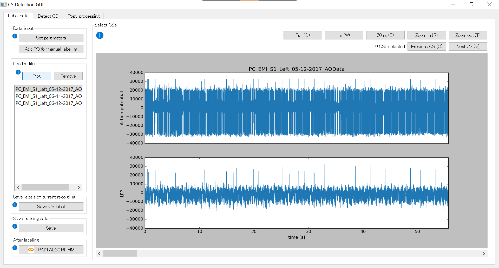
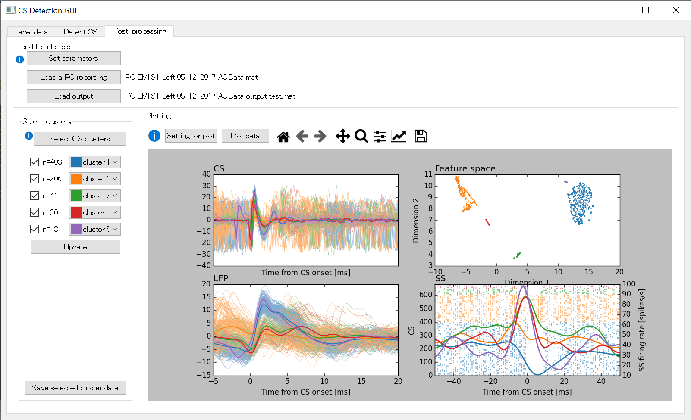

# A complete graphical user interface for detecting cerebellar complex spikes  

You can find our article on [journal of neurophysiology](https://journals.physiology.org/doi/full/10.1152/jn.00754.2019?rfr_dat=cr_pub++0pubmed&url_ver=Z39.88-2003&rfr_id=ori%3Arid%3Acrossref.org)

You can download our GUI here
[for Windows]() and
[for Mac]().

## <a name="top">How to use the GUI</a>

### [STEP 1: Labeling your data](#labeling)
### [STEP 2: Training the network](#training)
### [STEP 3: Detecting CSs](#detecting)
### [STEP 4: Post-processing](#post-processing) 
### [Trouble shooting](#trouble-shooting)

&nbsp;

## <a name="labeling">STEP1: Labeling your data</a>
This is how the GUI should look when opening it for the first time:


### 0: Data format

A file to be uploaded should contain the following variables in .mat format.
- High band-passed action potential: 1 x time
- low band-passed LFP: 1 x time    
- CS labels (optional): 1 x time 
    
    1 during CS dischage, 0 otherwise. 
    
    If you already have labeled CSs, you can also use them. But this variable is not necessary (you'll label CSs and create this variable in this section).

An example to save variables in MATLAB:
```Matlab
YourVariable = struct();
YourVariable.HIGH = HIGH;
YourVariable.RAW = RAW;
YourVariable.Labels = Labels;

save(FileName, '-struct', 'YourVariable');
```

An example to save variables in Python:
```python
import scipy.io as sp

sp.savemat(FileName, 
    {HIGH: HIGH, LFP: LFP, Labels: Labels,}, 
    do_compression=True)

# HIGH, LFP, Labels are numpy arrays
```

### 1: Choose parameters

The first thing to do when opening the GUI is setting your parameters. Click the ***Set parameters*** button in *Data input* section in the top left corner. You can set the following parameters.

- Sampling rate [Hz]
- Action potensial variable name
- LFP variable name
- CS label variable name

CS label is optional. If you haven't labeled CSs, you can leave this empty.

Although this is not tested and therefore not recommended, in case LFP is missing, you could set the LFP variable name same as action potentian (set both "HIGH", for example). 

### 2: Upload files

After that, you click on the ***Add PC for manual labeling*** button below ***Set parameters*** button and navigate to the folder with your recordings. Select a file and press *open* to load it. 

The file that is added should be plotted instantly after loading, so you can label instantly or load more files and select on which to start. All files will be added to the list in the *loaded files* section on the left, where you can select single files to plot or remove. 

After uploading and plotting, the GUI should look like this:


### 3: Label a recording

To label CSs from your recording, you can select a CS by clicking at the onset and dragging till the offset of a CS. Selected span will be colored with red. Select CS spans as accurately as possible in order to create a good training set. You can deselect a CS span by simply clicking on the red span.

We recommend labeling ~10 CSs uniformly througuout  the recording (not only from the first few seconds, for example), so that detection can be robust to the changes of the recording states.

To change the time range of the plot, use the following function buttons (and keyboard short cut):
- **Full (Q)**: Set the time range full
- **1s (W)**: Set the time range 1 s
- **50ms (E)**: Set the time range 50 ms
- **Zoom in (R)**: Zoom in 
- **Zoom out (T)**: Zoom out

Also, you can move the time range by using the slider below the plots, or keyboard shortcut **(D)** for going backward and **(F)** for going forward.

If you want to check CSs that you have already selected, use the following function buttons (and keyboard shortcut):

- **Previous CS (C)**: Jump to the previous CS
- **Next CS (V)**: Jump to the next CS


This is an example of a selected CS:


After labeling the first recording, select another file in your list and press "plot" to plot the new recording in the GUI and proceed with labling. 

### 4: Save CSs labels from current plot

This step is not necessary, but if you want to save your CS labels of each recording separately and reuse it for a differnt training set, use **Save CS labels** button in the *Save labels of current plot* section. This will save the following variables in a .mat format, just same as the one that you upload.
- High band-passed action potential: 1 x time
- low band-passed LFP: 1 x time    
- CS labels (optional): 1 x time 
    
    1 during CS dischage, 0 otherwise. 

### 5: Save training data
<a name="save-training-data"></a>

When you finished labeling all the uploaded files, press **Save** button in the *Save training data* section.
This will not save all the time range, but automatically select only the selected CS spans and some time before and after them from each file to include non-CS spans. This is done to reduce the data size and speed up the training.

The last step is to press the **Train algorithm** button and move to the training part in your browser.

### 6: Go to Google Colab

After you save the training data, click **TRAIN ALGORITHM** button in the *After labeling* section, this will take you to a Google Colab notebook to train the network.

<div style="text-align: right">

[back to top](#top)
</div>

## <a name="training"> STEP2: Training the network</a> 

Google Colab is a free cloud computing service for Jupyter notebook offered by Google. Here you can train your network fast and easily thanks to Google's powerful computational resources.

You can run each cell by clicking the triangle on the left or <kbd>Shift</kbd>+<kbd>Enter</kbd>.

**1: Let Google access your Google Drive**

First, in order to run this notebook, you need to give Google permission to access your Google Drive.

**2: Install the toolbox on your Google Drive**

This cell installs the necessary tools on your Google Drive. This process can take a few minutes.

**3: Upload your training data**

By running this cell, you can upload the training data that you have saved in the [fist step](#save-training-data).

If you receive an error "MessageError: TypeError: google.colab._files is undefined", check your browser's setting and allow third-party cookies.

**4: Advanced parameter setting**

You can change these paraeters only when the training does not work well. But it needs to be run for the training to work.

Max numner of iteration
- max_iter: default is 3000

The number of bins ($nb$) taken into account by the network. 
The default value was used for a sampling rate of 25 kHz. It is given by

$nb=mp^2+mp^2\cdot ks+(mp\cdot ks) - mp+2ks-2$
- ks: default is 9, needs to be odd
- mp: default is 7, needs to be odd

Check our [article](https://journals.physiology.org/doi/full/10.1152/jn.00754.2019?rfr_dat=cr_pub++0pubmed&url_ver=Z39.88-2003&rfr_id=ori%3Arid%3Acrossref.org)
for detail.


The fifth cells trains your network and needs no interactions other that running it.

**3: Downloading weights**

After your network is done with training, you can simply download the weights and select your preferred folder to save them in. This is the last step in your browser. You can return to the GUI after completing it.

<div style="text-align: right">

[back to top](#top)
</div>

## <a name="detecting">STEP3: Detecting complex spikes</a>

**1: Uploading files**  

After opening the GUI again, navigate to the "Detect CS" tab at the top. 
Choose if you want to detect on one or multiple files. Press the upper two buttons to upload a recording on which the algorithm will detect and to upload the weights you just saved from the Colab sheet in your browser. If you chose to detect on multiple files, you will need to specify an output folder as well.
This is the detection tab of the GUI when re-entering:


**2: Detecting CS**

By clicking the "Detect CS" button and pressing "ok" in the dialog the detection will start. The results of the algorithm will be saved in a file with the selected file name in the beginning and "output" in the end, so the name of the resulting file ist "yourfilename_output.mat.

You can move to the post-processing tab after running the algortihm to see your result and save clusters.

<div style="text-align: right">

[back to top](#top)
</div>

## <a name="post-processing">STEP4: Post-processing</a>

**1: Uploading files** 

Again, you first need to upload some files. This time, the loaded files have to be your recording from the last tab and the corresponding output file, so you should upload your file "filename.mat" as the upper file and your file "filename_output.mat" as the lower file.
The names are shown after selection, so you can check and reupload anytime.

**2: Plotting data**

press the "Setting for plot" button in the big plotting window to change parameters (like simple spike variable name or sampling rate) to your personally used values. These can be changed and adjusted after plotting. 
Press "Plot data" to see the CS clusters the algorithm detected on your file.
This is an example of how it should look after plotting your files:


**3: Selecting clusters and saving**

In the select clusters box the individual clusters can be selected to plot individually and outliers or noisy data can be deselected to remove from the results. The "update" button replots only the selected clusters.
Lastly, the "Save selected cluster data" lets you save the selected clusters as a matlab file. Additional information to any button can be found in tooltips by hovering the information button in every box.

<div style="text-align: right">

[back to top](#top)
</div>

## <a name="trouble-shooting">Trouble shooting</a>
In case the app crashes, you can run from a command prompt (on Windows) and see what kind of error is prompted.

<div style="text-align: right">

[back to top](#top)
</div>